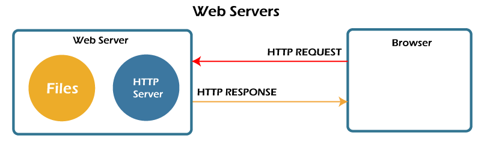
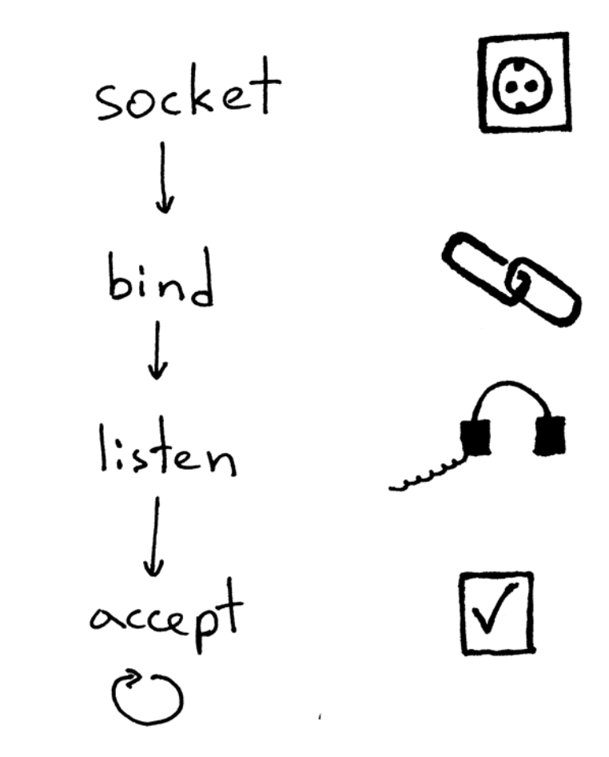
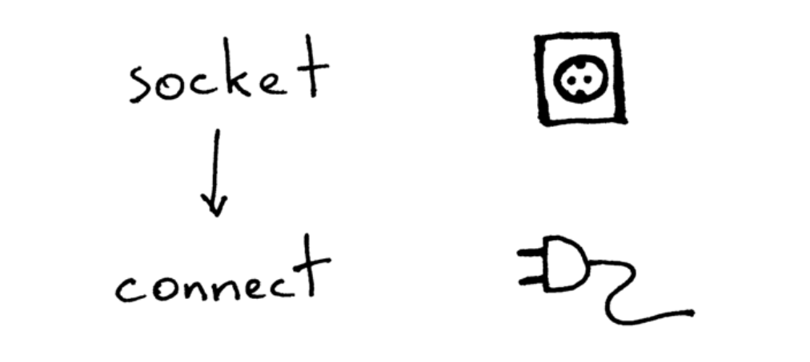
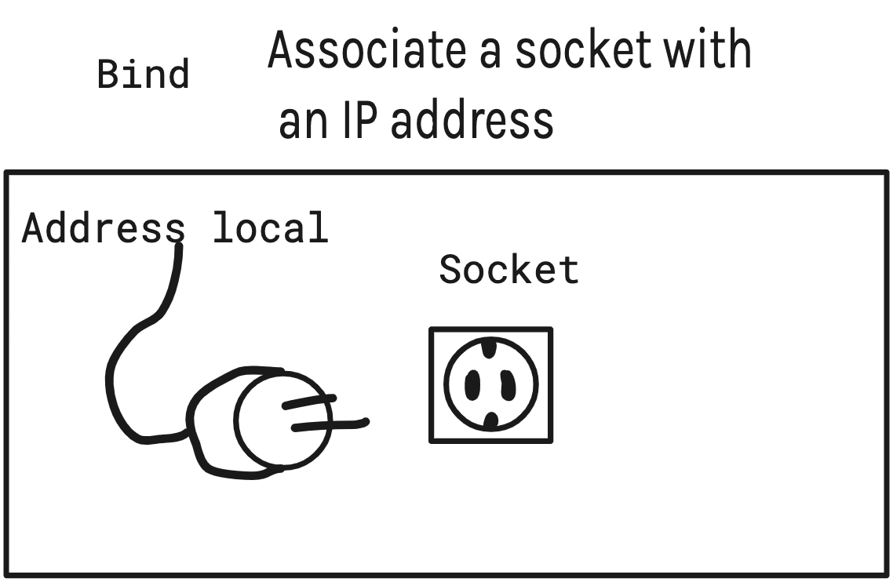
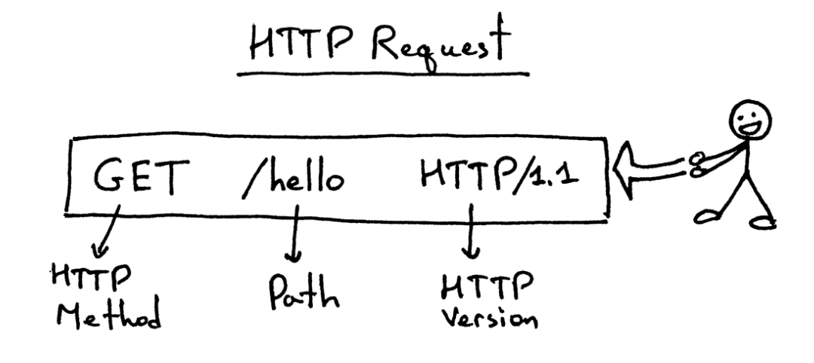
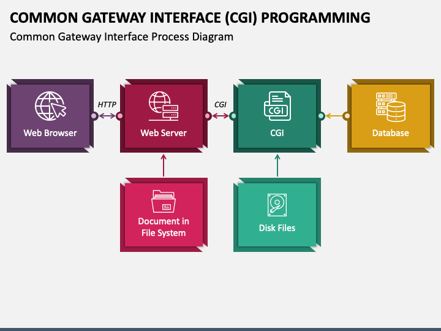
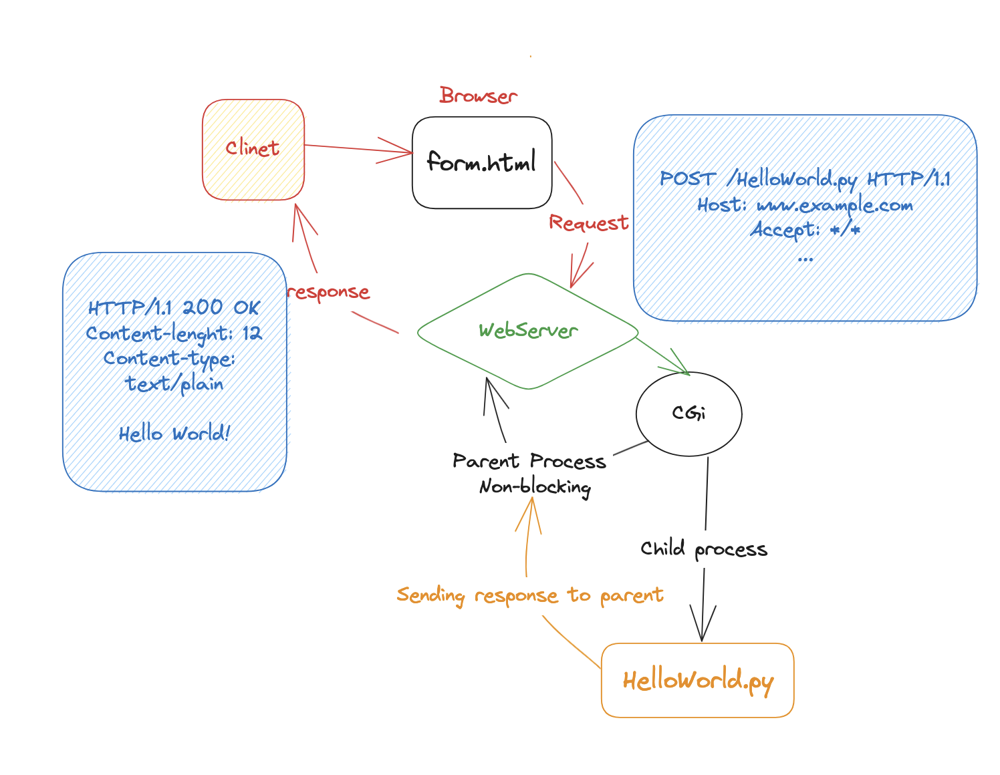

# WebServ_42

In this project, we will build our own web server. First, let's define what a web server is. A web server is a computer program that delivers web pages to users. When you visit a website, your web browser sends a request to the web server. The web server then sends the requested web page back to your web browser.

Many people use the internet to watch movies or send messages. The videos and images that you watch or send are stored in the cloud. The cloud is a network of servers that store data. When you watch a movie or send a message, the web server retrieves the video or image from the cloud and sends it to your web browser.

In this project, we will build a web server that can store and deliver web pages. We will use the Python programming language to create our web server.

### Socket-Bind-listing-connection

### Socket:
Sockets allow communication between two different processes on the same or different machines.

### Bind

bind is a system call that associates a socket with a local address and port number. This allows the socket to receive connections from other computers on the network.

### listen
is used to listen for incoming connections on a socket. The listen() function takes two arguments: the first argument is the socket file descriptor, and the second argument is the backlog queue size.
The backlog queue size is the maximum number of connections that can be queued before the system starts refusing connections.

### accept

is used to accept an incoming connection on a socket. The accept() function takes two arguments: the first argument is the socket file descriptor, and the second argument is a pointer to a sockaddr structure, which will be filled in with the address of the client that connected.

---
## HTTP 

HTTP stands for HyperText Transfer Protocol. It is a set of rules for exchanging data between a client and a server. HTTP is the foundation of the World Wide Web, and it is used to transfer all kinds of data, including HTML pages, images, videos, and files.
Here explain all of the previews :

#### Request:

##### RequestLine :

****
## CGI :
- **CGI** : (Common Gateway Interface) is used to provide a dynamic content to the user. It is a standard way for web servers to interact with external programs. CGI programs are typically written in scripting languages such as Perl, Python, or PHP.

When a user requests a page that contains a CGI script, the web server will execute the script and return the results to the user. This allows web servers to generate dynamic content, such as personalized web pages or interactive forms.

Here explain more about CGI how it's Work

****

### Resouces

* https://beej.us/guide/bgnet/html/split/system-calls-or-bust.html
* https://web.archive.org/web/20100127161358/http://hoohoo.ncsa.illinois.edu/cgi/
* https://www.rfc-editor.org/rfc/rfc6265
* https://www.youtube.com/playlist?list=PLZIwlOSv75K7jXcVABdIo3wyKp5NwXKlW
* https://www.youtube.com/watch?v=wB9tIg209-8